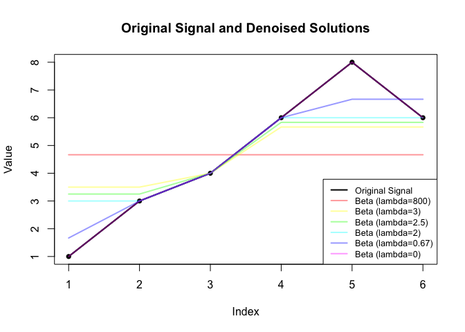

<!-- README.md is generated from README.Rmd. Please edit that file -->

# Overview

<!-- badges: start -->

<!-- badges: end -->

`TVDPathAlgo` is an R package designed to provide an efficient
path-following algorithm for solving Total Variation Denoising (TVD)
problems. It computes solutions for a sequence of regularization
parameters (lambda) while tracking the knot locations (change points) in
the resulting piecewise constant signal.

This main function in this package is `path_algo`. There are also other
functions involved in this packgae.

## Installation

Before installing TVDPathAlgo, ensure that you have the tvdenoising
package installed, as it is a key dependency. Both can be installed from
GitHub using the pak package:

``` r
# install.packages("pak")
pak::pkg_install("glmgen/tvdenoising")
pak::pkg_install("zhoumo2716/TVDPathAlgo")
```

## Example

This is a basic example:

``` r
library(TVDPathAlgo)

# Input signal
y <- c(1, 3, 4, 6, 8, 6)

# Solve using the path-following algorithm
result <- path_algo(y, method = "tri")

# View results
print(result$lambda_values)      # Sequence of lambda values
#> [1] 800.0000000   3.0000000   2.5000000   2.0000000   0.6666667   0.0000000
print(result$beta_values)        # Sequence of beta solutions for each lambda
#> [[1]]
#> [1] 4.666667 4.666667 4.666667 4.666667 4.666667 4.666667
#> 
#> [[2]]
#> [1] 3.500000 3.500000 4.000000 5.666667 5.666667 5.666667
#> 
#> [[3]]
#> [1] 3.250000 3.250000 4.000000 5.833333 5.833333 5.833333
#> 
#> [[4]]
#> [1] 3 3 4 6 6 6
#> 
#> [[5]]
#> [1] 1.666667 3.000000 4.000000 6.000000 6.666667 6.666667
#> 
#> [[6]]
#> [1] 1 3 4 6 8 6
print(result$knot_locations)     # Knot locations for each lambda
#> [[1]]
#> [1] 0
#> 
#> [[2]]
#> [1] 3 4
#> 
#> [[3]]
#> [1] 3 4
#> 
#> [[4]]
#> [1] 2 3 4
#> 
#> [[5]]
#> [1] 2 3 4 5
#> 
#> [[6]]
#> [1] 2 3 4 5 6
```

You can plot the original signal and the denoised solutions:

``` r
# Extract beta solutions as a matrix
beta_matrix <- do.call(cbind, result$beta_values)

# Set up colors with transparency
n_lambda <- length(result$lambda_values)
colors <- sapply(rainbow(n_lambda), function(col) adjustcolor(col, alpha.f = 0.4)) # 40% transparency

# Plot original signal
plot(y, type = "o", col = "black", pch = 16, lwd = 2, 
     ylim = range(c(y, beta_matrix)), xlab = "Index", ylab = "Value", 
     main = "Original Signal and Denoised Solutions")
lines(y, col = "black", lwd = 2)

# Add beta solutions with transparency
for (i in 1:n_lambda) {
  lines(beta_matrix[, i], col = colors[i], lwd = 2)
}

# Add legend at the bottom right
legend("bottomright", 
       legend = c("Original Signal", paste("Beta (lambda=", round(result$lambda_values, 2), ")", sep = "")),
       col = c("black", colors), lwd = 2, cex = 0.8)
```

 \## Functions

### `path_algo`

**Description**: Solves the Total Variation Denoising problem for a
given signal using a path-following algorithm.

**Arguments**:  
- `y`: Numeric vector (signal).  
- `lambda_0`: Non-negative numeric value for the initial lambda.  
- `method`: `"tri"` (tridiagonal optimization) or `"general"`.

**Returns**:  
- `lambda_index`: Indices corresponding to the lambda values.  
- `lambda_values`: Sequence of lambda values.  
- `knot_locations`: Knot locations for each lambda.  
- `beta_values`: Solutions at each lambda.  
- `loop_number`: Total number of iterations.

### `find_next_lambda`

**Description**: Finds the next regularization parameter (`lambda`) in
the sequence for the “general” method.

**Arguments**:  
- `y`: Numeric vector (signal).  
- `current_lambda`: Current value of the regularization parameter.  
- `B`: Current boundary set.  
- `S`: Current direction set.

**Returns**:  
- `next_lambda`: Next lambda value in the sequence.  
- `B_new`: Updated boundary set.  
- `S_new`: Updated direction set.

### `find_next_lambda_tri`

**Description**: Finds the next regularization parameter (`lambda`) in
the sequence for the “tri” (tridiagonal optimization) method. It solves
matrix inverse computation using `tridiagonal_inverse_matrix`.

**Arguments**:  
- `y`: Numeric vector (signal).  
- `current_lambda`: Current value of the regularization parameter.  
- `B`: Current boundary set.  
- `S`: Current direction set.

**Returns**:  
- `next_lambda`: Next lambda value in the sequence.  
- `B_new`: Updated boundary set.  
- `S_new`: Updated direction set.

### `tridiagonal_inverse_matrix`

**Description**: Computes the inverse of a tridiagonal matrix.

**Arguments**:  
- `A`: Tridiagonal matrix.

**Returns**:  
- Inverted matrix `A`.

### `solutions_cost`

**Description**: Ranks solutions generated by the `path_algo` function
based on a cost analysis. It balances noise reduction and signal
preservation using a weighted total cost metric. The weight is
controlled by the `alpha` parameter, where $`0 \leq \alpha \leq 1`$.

**Arguments**:  
- `result`: A list returned by the `path_algo` function, containing
`lambda_values`, `beta_values`, and related outputs.  
- `y`: Numeric vector (original signal).  
- `alpha`: Numeric value (default = 0.5). Specifies the weight for noise
reduction in the total cost calculation.

**Returns**:  
A data frame containing:  
- `lambda`: Lambda values corresponding to each solution.  
- `noise_reduction`: Mean squared error (MSE) between the signal $`y`$
and the solution $`\beta`$.  
- `signal_preservation`: Mean absolute difference (MAD) between
successive entries of $`\beta`$.  
- `total_cost`: Weighted sum of noise reduction and signal
preservation.  
- `rank`: Rank of each solution based on total cost (1 = best).

**Example Usage**:

``` r
library(TVDPathAlgo)
# Simulated signal
y <- c(1, 2, 3, 4)

# Generate path solutions
result <- path_algo(y, lambda_0 = 100, method = "tri")

# Rank solutions by total cost
ranked_results <- solutions_cost(result, y, alpha = 0.5)

# Print ranked results
print(ranked_results)
#>   lambda noise_reduction signal_preservation total_cost rank
#> 2      1            0.50           0.3333333  0.4166667    1
#> 3      0            0.00           1.0000000  0.5000000    2
#> 1    100            1.25           0.0000000  0.6250000    3
```

### `test_beta_linear_combination`

**Description**: Verifies the accuracy of constructing intermediate
solutions ($`\beta_{\lambda}`$) for a given lambda value using a
weighted linear combination of bounding solutions ($`\beta_{\lambda_k}`$
and $`\beta_{\lambda_{k+1}}`$).

**Arguments**:  
- `result`: A list returned by the `path_algo` function, containing
`lambda_values`, `beta_values`, and related outputs.  
- `lambda_test`: A numeric value specifying the intermediate lambda
value to test.  
- `y`: A numeric vector representing the original noisy signal.

**Returns**:  
A logical value (`TRUE`/`FALSE`) indicating whether the test passed.  
- `TRUE`: The objective values of the interpolated and actual solutions
differ by less than the specified tolerance ($`1 \times 10^{-6}`$).  
- `FALSE`: The objective values differ significantly, suggesting the
test failed.

**Example Usage**:

``` r
library(TVDPathAlgo)
y <- c(1, 3, 4, 6, 8, 6)
result <- path_algo(y, method = "tri")
lambda_test <- (result$lambda_values[2] + result$lambda_values[3]) / 2
test_beta_linear_combination(result, lambda_test, y)
#> Objective for interpolated beta: 12.01562 
#> Objective for actual beta: 12.01562
#> [1] TRUE
```
